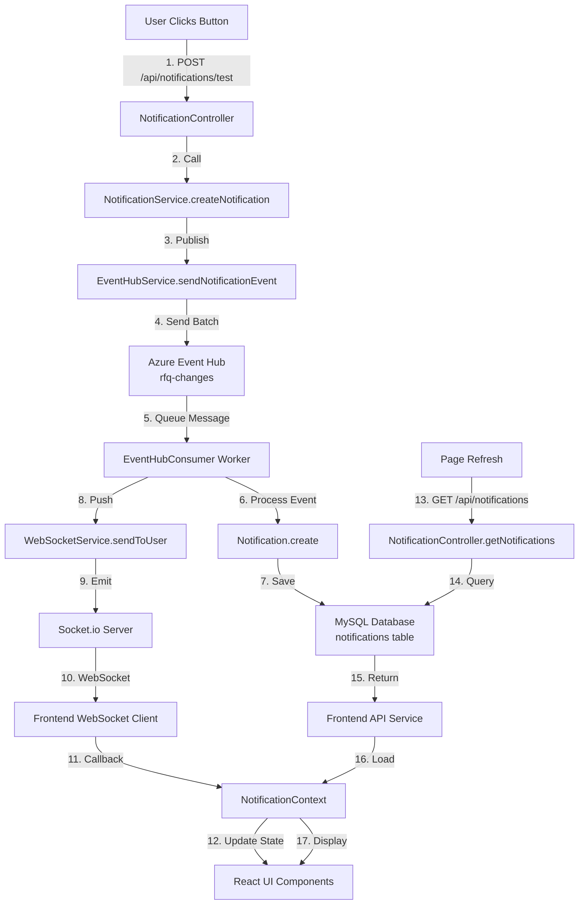

# Notification System - Detailed Flow & Code Explanation

## Complete Architecture Flow



## Step-by-Step Flow Explanation

### Phase 1: Notification Creation (User Action → Event Hub)

#### Step 1: User Action
**Location:** `frontend/src/pages/Dashboard.jsx`

```javascript
// User clicks "Send Test Notification" button
const sendTestNotification = async () => {
  const response = await api.post('/notifications/test');
  // API call is made
};
```

**What happens:**
- User clicks button
- Frontend makes POST request to `/api/notifications/test`
- Request includes JWT token in Authorization header

---

#### Step 2: API Route Handler
**Location:** `backend/src/routes/notificationRoutes.js`

```javascript
router.post('/test', notificationController.testNotification);
```

**What happens:**
- Express router receives request
- Routes to `NotificationController.testNotification`

---

#### Step 3: Controller Processing
**Location:** `backend/src/controllers/notificationController.js` (Lines 197-221)

```javascript
async testNotification(req, res) {
  const userId = req.user?.id || req.body.userId || 1;
  
  // Calls notification service
  const notification = await notificationService.createNotification(
    userId,
    'info',
    'Test Notification',
    'This is a test notification from Event Hub POC',
    { test: true, timestamp: new Date().toISOString() }
  );
  
  res.status(200).json({ success: true, notification });
}
```

**What happens:**
- Gets userId from authenticated user
- Calls `notificationService.createNotification()`
- Returns response immediately (doesn't wait for processing)

---

#### Step 4: Notification Service
**Location:** `backend/src/services/notificationService.js` (Lines 13-33)

```javascript
async createNotification(userId, type, title, message, data = {}) {
  // Create notification object
  const notification = {
    userId,
    type: type || 'info',
    title,
    message,
    data,
    timestamp: new Date().toISOString(),
    id: `notif_${Date.now()}_${Math.random().toString(36).substr(2, 9)}`
  };

  // ⭐ KEY STEP: Send to Event Hub
  await eventHubService.sendNotificationEvent(notification);

  return notification;
}
```

**What happens:**
- Creates notification object with metadata
- **Calls Event Hub Service** to publish message
- Returns immediately (async processing)

---

#### Step 5: Event Hub Service (Producer)
**Location:** `backend/src/services/eventHubService.js` (Lines 28-49)

```javascript
async sendNotificationEvent(notificationData) {
  // Initialize if not already done
  if (!this.producerClient) {
    await this.initialize();
  }

  // Create event data
  const eventData = {
    body: notificationData,
    contentType: 'application/json'
  };

  // Create batch and add event
  const batch = await this.producerClient.createBatch();
  batch.tryAdd(eventData);

  // ⭐ Send to Azure Event Hub
  await this.producerClient.sendBatch(batch);
  
  console.log('✅ Notification event sent to Event Hub');
  return true;
}
```

**What happens:**
- Initializes Azure Event Hub Producer Client (if needed)
- Creates event batch
- **Publishes message to Azure Event Hub** (`rfq-changes`)
- Message is now in Azure Event Hub queue

**Azure Event Hub:**
- Message stored in queue
- Available for consumption
- Partitioned for scalability

---

### Phase 2: Event Processing (Event Hub → Database → WebSocket)

#### Step 6: Event Hub Consumer (Background Worker)
**Location:** `backend/src/workers/eventHubConsumer.js`

**Initialization (Lines 15-61):**
```javascript
async start() {
  // Create Event Hub Consumer Client
  this.consumerClient = new EventHubConsumerClient(
    this.consumerGroup,  // '$Default'
    this.connectionString,
    this.eventHubName   // 'rfq-changes'
  );

  // Get all partitions
  const partitionIds = await this.consumerClient.getPartitionIds();
  
  // Subscribe to each partition
  for (const partitionId of partitionIds) {
    this.subscribeToPartition(partitionId);
  }
}
```

**What happens:**
- Consumer starts when server starts (see `server.js` line 59)
- Connects to Azure Event Hub
- Subscribes to all partitions
- Listens for new messages continuously

---

#### Step 7: Event Processing
**Location:** `backend/src/workers/eventHubConsumer.js` (Lines 63-117)

```javascript
async subscribeToPartition(partitionId) {
  this.consumerClient.subscribe(partitionId, {
    processEvents: async (events, context) => {
      for (const event of events) {
        const notificationData = event.body;
        
        // ⭐ STEP 7A: Save to Database
        const savedNotification = await Notification.create({
          userId: notificationData.userId,
          type: notificationData.type || 'info',
          title: notificationData.title,
          message: notificationData.message,
          data: dataToSave,
          isRead: false,
          emailSent: false
        });
        
        // ⭐ STEP 7B: Send via WebSocket
        webSocketService.sendToUser(
          notificationData.userId, 
          savedNotification
        );
      }
    }
  });
}
```

**What happens:**
- Consumer receives event from Event Hub
- **Saves notification to MySQL database** (persistence)
- **Pushes notification via WebSocket** (real-time)
- Both operations happen asynchronously

---

#### Step 8: Database Save
**Location:** `backend/src/models/Notification.js` (Lines 4-14)

```javascript
static async create(notificationData) {
  const { userId, type, title, message, data, isRead, emailSent } = notificationData;
  
  // Insert into database
  const [result] = await pool.execute(
    `INSERT INTO notifications (userId, type, title, message, data, isRead, emailSent) 
     VALUES (?, ?, ?, ?, ?, ?, ?)`,
    [userId, type, title, message, JSON.stringify(data || {}), isRead, emailSent]
  );
  
  // Return saved notification
  return this.findById(result.insertId);
}
```

**What happens:**
- Inserts notification into `notifications` table
- Stores JSON data as string
- Returns complete notification object with database ID

**Database Table Structure:**
```sql
CREATE TABLE notifications (
  id INT AUTO_INCREMENT PRIMARY KEY,
  userId INT NOT NULL,
  type VARCHAR(50) NOT NULL,
  title VARCHAR(255) NOT NULL,
  message TEXT NOT NULL,
  data JSON NULL,
  isRead BOOLEAN DEFAULT FALSE,
  emailSent BOOLEAN DEFAULT FALSE,
  createdAt TIMESTAMP DEFAULT CURRENT_TIMESTAMP,
  updatedAt TIMESTAMP DEFAULT CURRENT_TIMESTAMP ON UPDATE CURRENT_TIMESTAMP
);
```

---

#### Step 9: WebSocket Push
**Location:** `backend/src/services/websocketService.js` (Lines 42-53)

```javascript
sendToUser(userId, notification) {
  // Get socket ID for user
  const socketId = this.userSockets.get(userId);
  
  if (socketId && this.io) {
    // ⭐ Emit notification to specific user's socket
    this.io.to(socketId).emit('notification', notification);
    console.log(`✅ Notification sent to user ${userId}`);
    return true;
  } else {
    console.log(`⚠️ User ${userId} not connected`);
    return false;
  }
}
```

**What happens:**
- Looks up user's WebSocket connection
- If connected, emits `notification` event to that socket
- If not connected, logs warning (notification saved in DB, will load on next login)

**User Socket Mapping:**
- When user connects, `user:login` event stores: `userId → socketId`
- This mapping allows sending notifications to specific users

---

### Phase 3: Frontend Reception (WebSocket → UI)

#### Step 10: WebSocket Client Connection
**Location:** `frontend/src/services/websocketService.js` (Lines 10-57)

```javascript
connect(userId, token) {
  // Create Socket.io client connection
  this.socket = io(serverUrl, {
    transports: ['websocket', 'polling'],
    reconnection: true,
    auth: { token: token }
  });

  // On connection
  this.socket.on('connect', () => {
    console.log('✅ WebSocket connected');
    // Notify server about user
    this.socket.emit('user:login', userId);
  });

  // ⭐ Listen for notifications
  this.socket.on('notification', (notification) => {
    console.log('📬 Received notification:', notification);
    // Call all registered callbacks
    this.listeners.forEach((callback) => {
      callback(notification);
    });
  });
}
```

**What happens:**
- Creates WebSocket connection to server
- Sends `user:login` event with userId (for server mapping)
- Listens for `notification` events
- When received, calls all registered callbacks

---

#### Step 11: Notification Context
**Location:** `frontend/src/context/NotificationContext.jsx` (Lines 42-86)

```javascript
useEffect(() => {
  if (isAuthenticated && user) {
    // Load existing notifications from database
    loadNotifications();
    
    // Connect WebSocket
    webSocketService.connect(user.id, token);

    // ⭐ Register callback for real-time notifications
    const unsubscribe = webSocketService.onNotification((notification) => {
      console.log('📬 New notification received:', notification);
      
      // Add to state (if not duplicate)
      setNotifications(prev => {
        const exists = prev.some(n => n.id === notification.id);
        if (exists) return prev;
        return [notification, ...prev];
      });
      
      // Update unread count
      if (!notification.isRead) {
        setUnreadCount(prev => prev + 1);
      }
    });
  }
}, [isAuthenticated, user]);
```

**What happens:**
- On user login:
  1. **Loads existing notifications** from database (via API)
  2. **Connects WebSocket** for real-time updates
  3. **Registers callback** for new notifications
- When notification received:
  - Adds to notifications array
  - Updates unread count
  - Triggers React re-render

---

#### Step 12: UI Update
**Location:** `frontend/src/components/common/NotificationBell.jsx`

```javascript
const NotificationBell = () => {
  const { unreadCount } = useNotifications();
  
  return (
    <button onClick={() => setIsOpen(!isOpen)}>
      <BellIcon />
      {unreadCount > 0 && (
        <span className="badge">{unreadCount}</span>
      )}
    </button>
  );
};
```

**What happens:**
- React component subscribes to `NotificationContext`
- When `unreadCount` changes, component re-renders
- Badge shows unread count
- Clicking opens notification panel

---

### Phase 4: Page Refresh (Database → UI)

#### Step 13: Load on Refresh
**Location:** `frontend/src/context/NotificationContext.jsx` (Lines 23-40)

```javascript
const loadNotifications = async () => {
  try {
    // ⭐ Fetch from database via API
    const [notificationsData, unreadData] = await Promise.all([
      notificationService.getNotifications({ limit: 50 }),
      notificationService.getUnreadCount()
    ]);
    
    setNotifications(notificationsData.notifications || []);
    setUnreadCount(unreadData.unreadCount || 0);
  } catch (error) {
    console.error('Error loading notifications:', error);
  }
};
```

**What happens:**
- On page load/refresh:
  1. Calls API: `GET /api/notifications`
  2. Calls API: `GET /api/notifications/unread-count`
  3. Updates React state with loaded data
  4. UI displays notifications

---

#### Step 14: API Fetch
**Location:** `backend/src/controllers/notificationController.js` (Lines 9-43)

```javascript
async getNotifications(req, res) {
  const userId = req.user.id;
  const { limit, offset, isRead } = req.query;
  
  // ⭐ Query database
  const notifications = await Notification.findByUserId(userId, {
    limit: limitInt,
    offset: offsetInt,
    isRead: isReadValue
  });

  res.json({ success: true, notifications });
}
```

**What happens:**
- Gets userId from authenticated user
- Queries `notifications` table
- Returns user's notifications

---

#### Step 15: Database Query
**Location:** `backend/src/models/Notification.js` (Lines 42-80)

```javascript
static async findByUserId(userId, options = {}) {
  const { limit = 50, offset = 0, isRead = null } = options;
  
  let query = 'SELECT * FROM notifications WHERE userId = ?';
  const params = [userId];
  
  if (isRead !== null) {
    query += ' AND isRead = ?';
    params.push(isRead ? 1 : 0);
  }
  
  query += ` ORDER BY createdAt DESC LIMIT ${limitInt} OFFSET ${offsetInt}`;
  
  const [rows] = await pool.execute(query, params);
  
  // Parse JSON data
  return rows.map(row => {
    if (row.data && typeof row.data === 'string') {
      row.data = JSON.parse(row.data);
    }
    return row;
  });
}
```

**What happens:**
- Executes SQL query
- Filters by userId
- Optionally filters by isRead status
- Parses JSON data field
- Returns array of notifications

---

## Key Components Explained

### 1. Event Hub Service (Producer)
**Purpose:** Publish messages to Azure Event Hub

**Key Methods:**
- `initialize()` - Creates EventHubProducerClient
- `sendNotificationEvent()` - Publishes message to Event Hub

**Why Event Hub?**
- Decouples notification creation from processing
- Provides message queuing and reliability
- Enables async processing
- Scales with load

---

### 2. Event Hub Consumer (Worker)
**Purpose:** Consume messages from Event Hub and process them

**Key Methods:**
- `start()` - Initializes consumer and subscribes to partitions
- `subscribeToPartition()` - Handles events from each partition
- `processEvents()` - Processes each event (save DB + push WebSocket)

**Why Background Worker?**
- Doesn't block API response
- Can process messages even if API is busy
- Handles retries automatically

---

### 3. WebSocket Service (Backend)
**Purpose:** Manage WebSocket connections and push notifications

**Key Methods:**
- `initialize()` - Sets up Socket.io server
- `sendToUser()` - Sends notification to specific user
- `broadcast()` - Sends to all connected users

**User Mapping:**
- `userSockets` Map stores: `userId → socketId`
- When user connects, mapping is created
- When notification arrives, lookup socketId and emit

---

### 4. WebSocket Service (Frontend)
**Purpose:** Connect to WebSocket server and receive notifications

**Key Methods:**
- `connect()` - Establishes WebSocket connection
- `onNotification()` - Registers callback for notifications
- `disconnect()` - Closes connection

**Connection Lifecycle:**
1. User logs in → `connect()` called
2. Connection established → `user:login` event sent
3. Server stores mapping
4. Notifications received → callbacks called
5. User logs out → `disconnect()` called

---

### 5. Notification Context (Frontend)
**Purpose:** Manage notification state and coordinate loading/pushing

**Key Features:**
- **Initial Load:** Fetches from database on mount
- **Real-time Updates:** Receives via WebSocket
- **State Management:** Maintains notifications array and unread count
- **Persistence:** Mark as read updates database

**State Flow:**
```
Initial: [] (empty)
  ↓
Load from DB: [notif1, notif2, ...]
  ↓
WebSocket receives: [newNotif, notif1, notif2, ...]
  ↓
User marks read: [newNotif (read), notif1, notif2, ...]
```

---

## Data Flow Summary

### Creating Notification:
```
User Click → API → NotificationService → EventHubService → Azure Event Hub
                                                              ↓
                                                         (Message Queued)
```

### Processing Notification:
```
Event Hub → Consumer Worker → Database Save + WebSocket Push
                                    ↓              ↓
                              (Persisted)    (Real-time UI Update)
```

### Loading Notifications:
```
Page Load → API Call → Database Query → Return Data → Update UI
```

### Real-time Updates:
```
New Notification → Event Hub → Consumer → WebSocket → Frontend → UI Update
```

---

## Why This Architecture?

### Benefits:
1. **Async Processing:** API responds immediately, processing happens in background
2. **Reliability:** Event Hub ensures messages aren't lost
3. **Scalability:** Can add more consumer workers
4. **Real-time:** WebSocket provides instant updates
5. **Persistence:** Database ensures notifications survive page refresh
6. **Decoupling:** Components are independent, easy to modify

### Trade-offs:
- More complex than direct database writes
- Requires Azure Event Hub service
- Additional infrastructure to manage

---

## Environment Variables Used

```env
# Azure Event Hub
EVENT_HUB_CONN_STRING=Endpoint=sb://fieldfix.servicebus.windows.net/;...
EVENT_HUB_NAME=rfq-changes

# WebSocket (Frontend)
REACT_APP_WS_URL=http://localhost:5000
```

---

## Error Handling

### Event Hub Connection Failure:
- Consumer logs error but server continues
- Notifications won't be processed until Event Hub is available
- API still works (can create notifications, they'll queue in Event Hub)

### Database Save Failure:
- Logs error
- Still tries to send via WebSocket
- Notification might be lost if both fail

### WebSocket Connection Failure:
- Frontend logs error
- Falls back to polling (via API)
- Notifications still load on page refresh

---

## Performance Considerations

1. **Event Hub Batching:** Messages are batched for efficiency
2. **Database Indexing:** Indexes on userId, isRead, createdAt for fast queries
3. **WebSocket Reconnection:** Automatic reconnection with exponential backoff
4. **State Optimization:** React state updates only when needed
5. **Pagination:** Notifications loaded with limit/offset

---

## Testing the Flow

1. **Send Notification:**
   ```bash
   POST /api/notifications/test
   ```

2. **Check Logs:**
   - Backend: "Notification event sent to Event Hub"
   - Backend: "Received notification from partition"
   - Backend: "Notification saved to database"
   - Backend: "Notification sent to user X"
   - Frontend: "Received notification"

3. **Verify:**
   - Notification appears in UI immediately
   - Refresh page → notification still there
   - Unread count updates

---

## Future Enhancements

1. **Email Notifications:** Add Azure Communication Services
2. **Push Notifications:** Add browser push API
3. **Notification Preferences:** User settings for notification types
4. **Notification History:** Pagination and filtering
5. **Bulk Operations:** Mark multiple as read
6. **Notification Templates:** Reusable notification formats

